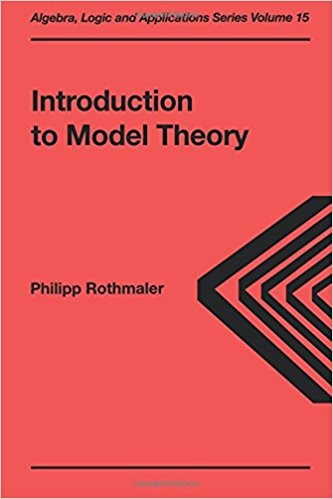

---?image=assets/image/Welcome.jpg&size=auto&opacity="0.25"

# Model Theory

+++

## MATH 6000: Model Theory

- **Instructor:**  William DeMeo    
- **Email:** [williamdemeo@gmail.com](mailto:williamdemeo@gmail.com)   
- **Office:** [Math Building](https://www.google.com/maps/place/Mathematics+Building,+Boulder,+CO+80305/@40.0077558,-105.2651941,18z/data=!3m1!4b1!4m5!3m4!1s0x876bedcb63fc434b:0x103526dd5cc47ed7!8m2!3d40.0077558!4d-105.2645434) Room 202   
- **Office hours:** TBA.
- **Registration Restrictions:**  Graduate students only    

+++

## Course Web Pages

@fa[github](**Main Course Page** (GitHub))   
https://github.com/williamdemeo/math6000-spring2018

@fa[users](**Online Discussions** (Piazza))   https://piazza.com/colorado/spring2018/math6000/home

+++

### Textbook

- **Title:** [Introduction to Model Theory](https://www.barnesandnoble.com/noresults/introduction-to-model-theory-philipp-rothmaler/)    
- **Author:** Philipp Rothmaler
- **Publisher:** Taylor & Francis 
- **Publication Date:** Sep 2000   
- **ISBN-13:** 9789056993139  
- **List Price:** $79

---

### Course Description

**From the course catalog.** Proves the compactness theorem, showing the essential
finiteness of logical implication. Proves many basic properties of theories,
showing how the syntactic form of statements influences their behavior with
respect to different models. Finally, studies properties of elements that cannot
be stated by a single formula (the type of the element) and shows it can be used
to characterize certain models.

+++

### Grading Policy

- Grades will be based on student's work on 12 problem sets |
- A if problem sets reveal mastery of central concepts and theorems |
- B if problem sets reveal grasp of the basic concepts, short of mastery |
- Possible Strategy: each problem set graded pass/fail. A for passing at least 9 problem sets; B for passing at least 6 problem sets |

+++

### Final Exam

@fa[thumbs-up](There are no exams in this class!)

The material is not well-suited to an in-class, 2.5 hour writing effort.

The final problem set that may be wider in scope than previous problem sets.
